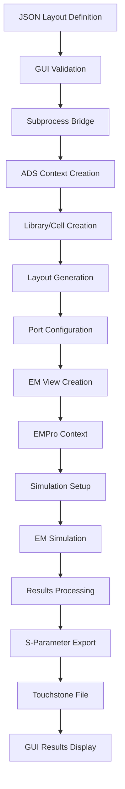

# RFIC Layout-to-EM Simulation GUI - Main Architecture Documentation

## Overview

The RFIC Layout-to-EM Simulation GUI system is a sophisticated multi-layer application that bridges the gap between high-level JSON-based layout definitions and low-level Keysight ADS/EMPro simulation environments. The system implements a **three-tier architecture** that ensures complete isolation between the user interface and the specialized ADS/EMPro Python environments.

## System Architecture

### Three-Tier Design Pattern

```
┌─────────────────────────────────────────────────────────────┐
│                    GUI Layer (Tier 1)                        │
│  ┌─────────────────┐  ┌─────────────────┐  ┌─────────────┐  │
│  │   subprocess_gui.py   │  │  Layout Generator  │  │  Config  │  │
│  └─────────────────┘  └─────────────────┘  └─────────────┘  │
└─────────────────────────────┬───────────────────────────────┘
                              │ JSON Communication
┌─────────────────────────────┴───────────────────────────────┐
│                 Bridge Layer (Tier 2)                        │
│                    subprocess_worker.py                        │
│  ┌─────────────────┐  ┌─────────────────┐  ┌─────────────┐  │
│  │  Environment    │  │   Task Router   │  │   Error    │  │
│  │    Manager      │  │   & Handler     │  │  Handler   │  │
│  └─────────────────┘  └─────────────────┘  └─────────────┘  │
└─────────────────────────────┬───────────────────────────────┘
                              │ Context Switching
┌─────────────────────────────┴───────────────────────────────┐
│                    ADS Layer (Tier 3)                        │
│  ┌─────────────────┐  ┌─────────────────┐  ┌─────────────┐  │
│  │   ADS Context   │  │  EMPro Context  │  │   PDK     │  │
│  │   Operations    │  │   Operations    │  │  Support  │  │
│  └─────────────────┘  └─────────────────┘  └─────────────┘  │
└─────────────────────────────────────────────────────────────┘
```

## Core Components

### 1. GUI Layer (`subprocess_gui.py`)

The primary user interface component that provides:

- **Tabbed Interface**: 5 specialized tabs for complete workflow management
- **Real-time Preview**: Interactive layout visualization
- **Progress Tracking**: Real-time simulation progress with logging
- **Error Handling**: User-friendly error messages with technical details

#### Tab Architecture

| Tab | Purpose | Key Features |
|-----|---------|--------------|
| **Input** | JSON file management | File selection, preview, validation |
| **Configuration** | Simulation setup | Workspace paths, frequency ranges |
| **PDK Config** | Technology selection | PDK vs reference library modes |
| **Layer Mapping** | Technology mapping | JSON→ADS layer mapping |
| **Results** | S-parameter analysis | Touchstone parsing, plotting |

### 2. Bridge Layer (`subprocess_worker.py`)

The critical isolation component that:

- **Environment Detection**: Automatically finds ADS Python installations
- **Context Management**: Handles ADS vs EMPro context switching
- **Error Forwarding**: Captures and forwards errors with full tracebacks
- **Resource Cleanup**: Ensures proper cleanup of ADS resources

#### Environment Detection Strategy

```python
class EnvironmentManager:
    def __init__(self):
        self.ads_python_paths = [
            r"C:\Path\To\ADS\tools\python\python.exe",
            r"C:\Path\To\ADS\fem\2026.xx\win32_64\bin\tools\win32\python\python.exe"
        ]
    
    def find_ads_python(self):
        """Multi-path detection with fallback mechanisms"""
        for path in self.ads_python_paths:
            if os.path.exists(path):
                return path
        raise EnvironmentError("ADS Python not found")
```

### 3. ADS Layer

The actual ADS/EMPro integration layer providing:

- **Design Creation**: Complete ADS library/cell/view creation
- **Geometry Generation**: Matrix-to-polygon conversion
- **Port Configuration**: Automated port placement and setup
- **Simulation Control**: Full EM simulation lifecycle management

## Communication Protocol

### JSON-Based IPC

The system uses a sophisticated JSON-based inter-process communication protocol:

#### Request Format
```json
{
  "task": "create_design",
  "parameters": {
    "workspace_path": "C:\\Path\\To\\Workspaces\\Test",
    "library_name": "TestLib",
    "cell_name": "TestCell",
    "json_file": "layout_definition.json",
    "config": {
      "frequency_range": ["1MHz", "50GHz"],
      "simulation_type": "momentum",
      "mesh_density": "50 cpw"
    }
  },
  "timestamp": "2024-01-01T12:00:00Z"
}
```

#### Response Format
```json
{
  "status": "success|error",
  "result": {
    "workspace_path": "C:\\Path\\To\\Workspaces\\Test",
    "library_name": "TestLib",
    "cell_name": "TestCell",
    "em_view": "rfpro_view",
    "s_parameters": "C:\\Path\\To\\Workspaces\\Test\\TestLib\\TestCell\\rfpro_view\\ds\\S_Params.s2p"
  },
  "error": {
    "type": "ADSException",
    "message": "Port configuration error",
    "traceback": "..."
  },
  "execution_time": 45.3
}
```

### Context Switching Mechanism

The system implements sophisticated context switching:

```python
# ADS Context Operations
with multi_python.ads_context() as ads_ctx:
    result = ads_ctx.call(
        create_ads_design,
        args=[task_data],
        timeout=300
    )

# EMPro Context Operations
with multi_python.xxpro_context() as empro_ctx:
    result = empro_ctx.call(
        run_em_simulation,
        args=[task_data],
        timeout=1800
    )
```

## Data Flow Architecture

### Complete Pipeline Flow



### Memory Management Strategy

The system implements comprehensive memory management:

1. **Lazy Loading**: Components loaded only when needed
2. **Context Reuse**: Efficient use of ADS contexts
3. **Resource Cleanup**: Automatic cleanup of temporary files
4. **Garbage Collection**: Explicit cleanup of ADS objects

```python
def cleanup_resources():
    """Comprehensive resource cleanup"""
    try:
        # Close active workspace
        if de.workspace_is_open():
            workspace = de.active_workspace()
            workspace.close()
        
        # Clean temporary files
        temp_files = glob.glob(os.path.join(temp_dir, "ads_*.tmp"))
        for file in temp_files:
            try:
                os.remove(file)
            except:
                pass
    except Exception as e:
        logger.error(f"Cleanup error: {e}")
```

## Configuration Management

### Centralized Configuration

The system uses a hierarchical configuration system:

#### Global Configuration
```python
# Default configuration structure
GLOBAL_CONFIG = {
    "ads_paths": {
        "base_dir": "C:\\Program Files\\Keysight\\ADS2025_Update2",
        "python_paths": [...],
        "pdk_paths": [...]
    },
    "simulation_defaults": {
        "frequency_range": ["1MHz", "50GHz"],
        "mesh_density": "50 cpw",
        "solver_type": "Momentum"
    },
    "export_settings": {
        "formats": ["s2p", "ds", "csv"],
        "path_mode": "relative",
        "include_metadata": True
    }
}
```

#### Project-Specific Configuration
```python
# Project configuration override
PROJECT_CONFIG = {
    "technology": {
        "process": "TSMC65nm",
        "pdk_path": "C:\\Path\\To\\PDKs\\TSMC65\\ADS",
        "substrate": "microstrip"
    },
    "simulation": {
        "frequency_sweep": "log",
        "points_per_decade": 10,
        "adaptive_sampling": True
    }
}
```

## Security and Isolation

### Environment Isolation

The system provides complete isolation between GUI and ADS environments:

1. **Process Isolation**: Separate Python processes
2. **File System Isolation**: Temporary working directories
3. **Network Isolation**: No network dependencies
4. **Permission Isolation**: Runs with user permissions only

### Error Containment

```python
class ErrorHandler:
    def __init__(self):
        self.error_levels = {
            'critical': self.handle_critical,
            'warning': self.handle_warning,
            'info': self.handle_info
        }
    
    def handle_critical(self, error):
        """Critical error handling with graceful degradation"""
        # Save current state
        self.save_recovery_state()
        # Clean resources
        self.cleanup_resources()
        # Notify user
        self.show_error_dialog(error)
```

## Scalability Considerations

### Horizontal Scaling

The architecture supports horizontal scaling through:

1. **Batch Processing**: Multiple designs processed sequentially
2. **Parallel Processing**: Context-based parallel execution
3. **Queue Management**: Job queue with priority handling
4. **Resource Pooling**: Context reuse and pooling

### Performance Monitoring

```python
class PerformanceMonitor:
    def __init__(self):
        self.metrics = {
            'design_creation_time': [],
            'simulation_time': [],
            'memory_usage': [],
            'error_rate': []
        }
    
    def track_operation(self, operation_type, duration, success=True):
        self.metrics[operation_type].append({
            'duration': duration,
            'timestamp': datetime.now(),
            'success': success
        })
```

This architecture provides a robust, scalable, and maintainable foundation for RFIC layout-to-simulation automation, ensuring compatibility across different ADS versions and technology nodes while maintaining excellent user experience and error handling.
