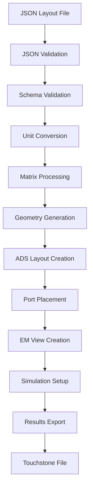

# JSON Layout Schema and Data Flow Documentation

## Overview

The JSON layout schema is the fundamental data structure that bridges high-level RFIC layout definitions with low-level ADS/EMPro geometry creation. This schema provides a technology-agnostic, matrix-based representation of RFIC layouts that can be easily generated, modified, and processed by both human designers and automated systems.

## JSON Schema Specification

### Root Schema Structure

```json
{
  "$schema": "http://json-schema.org/draft-07/schema#",
  "type": "object",
  "title": "RFIC Layout Definition",
  "description": "Complete RFIC layout definition for EM simulation",
  "required": ["design_id", "metadata", "layout_matrices"],
  "properties": {
    "design_id": {"type": "string", "description": "Unique design identifier"},
    "metadata": {"$ref": "#/definitions/metadata"},
    "layout_matrices": {"$ref": "#/definitions/layout_matrices"},
    "port_definitions": {"$ref": "#/definitions/port_definitions"},
    "simulation_config": {"$ref": "#/definitions/simulation_config"},
    "technology_info": {"$ref": "#/definitions/technology_info"}
  }
}
```

### Metadata Schema

```json
{
  "definitions": {
    "metadata": {
      "type": "object",
      "required": ["process", "pixel_size_um", "base_matrix_shape"],
      "properties": {
        "process": {
          "type": "string",
          "description": "Technology process node",
          "examples": ["TSMC65nm", "TSMC28nm", "GlobalFoundries22nm"]
        },
        "pixel_size_um": {
          "type": "number",
          "description": "Physical size of one pixel in micrometers",
          "minimum": 0.1,
          "maximum": 1000.0,
          "examples": [14.0, 28.0, 50.0]
        },
        "base_matrix_shape": {
          "type": "array",
          "description": "Base matrix dimensions [rows, cols]",
          "items": {"type": "integer", "minimum": 1},
          "minItems": 2,
          "maxItems": 2,
          "examples": [[16, 16], [32, 32], [64, 64]]
        },
        "design_name": {"type": "string", "description": "Human-readable design name"},
        "description": {"type": "string", "description": "Design description"},
        "created_by": {"type": "string", "description": "Creator identifier"},
        "created_date": {"type": "string", "format": "date-time"},
        "version": {"type": "string", "pattern": "^\\d+\\.\\d+\\.\\d+$"}
      }
    }
  }
}
```

### Layout Matrices Schema

```json
{
  "definitions": {
    "layout_matrices": {
      "type": "object",
      "description": "Layer-based layout matrices",
      "additionalProperties": {
        "type": "array",
        "description": "Binary matrix for a specific layer",
        "items": {
          "type": "array",
          "items": {"type": "integer", "enum": [0, 1]}
        }
      },
      "examples": [
        {
          "METAL1": [[0, 1, 0], [1, 1, 1], [0, 1, 0]],
          "METAL2": [[1, 0, 1], [0, 1, 0], [1, 0, 1]]
        }
      ]
    }
  }
}
```

### Port Definitions Schema

```json
{
  "definitions": {
    "port_definitions": {
      "type": "array",
      "description": "Port definitions for EM simulation",
      "items": {
        "type": "object",
        "required": ["port_id", "name", "layer", "edge", "position_index"],
        "properties": {
          "port_id": {
            "type": "integer",
            "description": "Unique port identifier",
            "minimum": 1
          },
          "name": {
            "type": "string",
            "description": "Port name (must be unique)",
            "pattern": "^P\\d+$"
          },
          "layer": {
            "type": "string",
            "description": "Layer name where port is placed"
          },
          "edge": {
            "type": "string",
            "enum": ["left", "right", "top", "bottom"],
            "description": "Edge placement for port"
          },
          "position_index": {
            "type": "integer",
            "description": "Position along the edge (0-based indexing)",
            "minimum": 0
          },
          "impedance": {
            "type": "number",
            "description": "Port impedance in ohms",
            "default": 50.0,
            "minimum": 1.0,
            "maximum": 1000.0
          },
          "description": {"type": "string", "description": "Port description"}
        }
      }
    }
  }
}
```

## Complete Schema Example

### Microstrip Transmission Line

```json
{
  "design_id": "microstrip_line_001",
  "metadata": {
    "process": "TSMC65nm",
    "pixel_size_um": 14.0,
    "base_matrix_shape": [32, 64],
    "design_name": "Microstrip Transmission Line",
    "description": "5mm microstrip line for S-parameter extraction",
    "created_by": "RFIC_Designer",
    "created_date": "2024-01-15T10:30:00Z",
    "version": "1.0.0"
  },
  "layout_matrices": {
    "METAL1": [
      [0, 0, 0, 0, 0, 0, 0, 0, 0, 0, 0, 0, 0, 0, 0, 0, 0, 0, 0, 0, 0, 0, 0, 0, 0, 0, 0, 0, 0, 0, 0, 0, 0, 0, 0, 0, 0, 0, 0, 0, 0, 0, 0, 0, 0, 0, 0, 0, 0, 0, 0, 0, 0, 0, 0, 0, 0, 0, 0, 0, 0, 0, 0, 0],
      [0, 0, 0, 0, 0, 0, 0, 0, 0, 0, 0, 0, 0, 0, 0, 0, 0, 0, 0, 0, 0, 0, 0, 0, 0, 0, 0, 0, 0, 0, 0, 0, 0, 0, 0, 0, 0, 0, 0, 0, 0, 0, 0, 0, 0, 0, 0, 0, 0, 0, 0, 0, 0, 0, 0, 0, 0, 0, 0, 0, 0, 0, 0, 0],
      [0, 0, 0, 0, 0, 0, 0, 0, 0, 0, 0, 0, 0, 0, 0, 0, 0, 0, 0, 0, 0, 0, 0, 0, 0, 0, 0, 0, 0, 0, 0, 0, 0, 0, 0, 0, 0, 0, 0, 0, 0, 0, 0, 0, 0, 0, 0, 0, 0, 0, 0, 0, 0, 0, 0, 0, 0, 0, 0, 0, 0, 0, 0, 0],
      [1, 1, 1, 1, 1, 1, 1, 1, 1, 1, 1, 1, 1, 1, 1, 1, 1, 1, 1, 1, 1, 1, 1, 1, 1, 1, 1, 1, 1, 1, 1, 1, 1, 1, 1, 1, 1, 1, 1, 1, 1, 1, 1, 1, 1, 1, 1, 1, 1, 1, 1, 1, 1, 1, 1, 1, 1, 1, 1, 1, 1, 1, 1, 1],
      [0, 0, 0, 0, 0, 0, 0, 0, 0, 0, 0, 0, 0, 0, 0, 0, 0, 0, 0, 0, 0, 0, 0, 0, 0, 0, 0, 0, 0, 0, 0, 0, 0, 0, 0, 0, 0, 0, 0, 0, 0, 0, 0, 0, 0, 0, 0, 0, 0, 0, 0, 0, 0, 0, 0, 0, 0, 0, 0, 0, 0, 0, 0, 0],
      [0, 0, 0, 0, 0, 0, 0, 0, 0, 0, 0, 0, 0, 0, 0, 0, 0, 0, 0, 0, 0, 0, 0, 0, 0, 0, 0, 0, 0, 0, 0, 0, 0, 0, 0, 0, 0, 0, 0, 0, 0, 0, 0, 0, 0, 0, 0, 0, 0, 0, 0, 0, 0, 0, 0, 0, 0, 0, 0, 0, 0, 0, 0, 0]
    ]
  },
  "port_definitions": [
    {
      "port_id": 1,
      "name": "P1",
      "layer": "METAL1",
      "edge": "left",
      "position_index": 16,
      "impedance": 50.0,
      "description": "Input port"
    },
    {
      "port_id": 2,
      "name": "P2",
      "layer": "METAL1",
      "edge": "right",
      "position_index": 16,
      "impedance": 50.0,
      "description": "Output port"
    }
  ],
  "simulation_config": {
    "frequency_range": ["1MHz", "50GHz"],
    "frequency_points": 1000,
    "solver_type": "momentum",
    "mesh_density": "50 cpw"
  },
  "technology_info": {
    "substrate": {
      "type": "microstrip",
      "dielectric": {
        "material": "FR4",
        "thickness_um": 508,
        "permittivity": 4.4,
        "loss_tangent": 0.02
      },
      "conductor": {
        "material": "copper",
        "thickness_um": 35,
        "conductivity": 5.8e7
      }
    }
  }
}
```

## Data Flow Architecture

### Complete Pipeline Flow



### Data Transformation Stages

#### Stage 1: JSON Parsing and Validation

```python
class JSONLayoutParser:
    """Comprehensive JSON layout parser with validation"""
    
    def __init__(self, schema_path=None):
        self.schema = self._load_schema(schema_path)
        self.validator = jsonschema.Draft7Validator(self.schema)
    
    def parse_layout(self, json_file):
        """Parse and validate JSON layout file"""
        
        with open(json_file, 'r') as f:
            layout_data = json.load(f)
        
        # Validate against schema
        errors = list(self.validator.iter_errors(layout_data))
        if errors:
            raise ValueError(f"Schema validation failed: {errors}")
        
        # Extract components
        metadata = layout_data['metadata']
        matrices = layout_data['layout_matrices']
        ports = layout_data.get('port_definitions', [])
        config = layout_data.get('simulation_config', {})
        
        return {
            'metadata': metadata,
            'matrices': matrices,
            'ports': ports,
            'config': config
        }
    
    def validate_geometry(self, matrices, metadata):
        """Validate geometric constraints"""
        
        base_shape = metadata['base_matrix_shape']
        
        for layer_name, matrix in matrices.items():
            # Check matrix dimensions
            if len(matrix) != base_shape[0] or len(matrix[0]) != base_shape[1]:
                raise ValueError(
                    f"Layer {layer_name} dimensions {len(matrix)}x{len(matrix[0])} "
                    f"don't match base shape {base_shape}"
                )
            
            # Check for empty layers
            if not any(any(row) for row in matrix):
                logger.warning(f"Layer {layer_name} is empty")
        
        return True
```

#### Stage 2: Unit Conversion and Scaling

```python
class UnitConverter:
    """Handle unit conversions for layout data"""
    
    def __init__(self, target_units='um'):
        self.target_units = target_units
        self.conversion_factors = {
            'um': 1.0,
            'mm': 1000.0,
            'nm': 0.001,
            'm': 1000000.0
        }
    
    def convert_layout_units(self, layout_data, source_units='um'):
        """Convert all units in layout data to target units"""
        
        factor = self.conversion_factors[self.target_units] / self.conversion_factors[source_units]
        
        # Convert pixel size
        pixel_size = layout_data['metadata']['pixel_size_um'] * factor
        layout_data['metadata']['pixel_size_target'] = pixel_size
        
        # Convert technology info
        if 'technology_info' in layout_data:
            tech_info = layout_data['technology_info']
            if 'substrate' in tech_info:
                self._convert_substrate_units(tech_info['substrate'], factor)
        
        return layout_data
    
    def _convert_substrate_units(self, substrate, factor):
        """Convert substrate layer thicknesses"""
        
        if 'dielectric' in substrate:
            substrate['dielectric']['thickness_target'] = substrate['dielectric']['thickness_um'] * factor
        
        if 'conductor' in substrate:
            substrate['conductor']['thickness_target'] = substrate['conductor']['thickness_um'] * factor
```

#### Stage 3: Geometry Processing

```python
class GeometryProcessor:
    """Process matrix data into geometric primitives"""
    
    def __init__(self, pixel_size):
        self.pixel_size = pixel_size
    
    def process_layer(self, matrix, layer_name):
        """Convert binary matrix to geometric primitives"""
        
        import numpy as np
        from skimage import measure
        
        # Convert to numpy array
        arr = np.array(matrix)
        
        # Find connected components
        labeled = measure.label(arr, connectivity=2)
        regions = measure.regionprops(labeled)
        
        geometries = []
        
        for region in regions:
            # Get polygon coordinates
            coords = self._region_to_polygon(region)
            
            # Calculate properties
            properties = {
                'area': region.area * (self.pixel_size ** 2),
                'perimeter': region.perimeter * self.pixel_size,
                'centroid': (region.centroid[1] * self.pixel_size, region.centroid[0] * self.pixel_size),
                'bbox': self._bbox_to_coords(region.bbox)
            }
            
            geometries.append({
                'layer': layer_name,
                'coordinates': coords,
                'properties': properties
            })
        
        return geometries
    
    def _region_to_polygon(self, region):
        """Convert region to polygon coordinates"""
        
        # Get contour
        contour = measure.find_contours(region.image, 0.5)[0]
        
        # Scale to physical coordinates
        coords = [(y * self.pixel_size, x * self.pixel_size) 
                 for x, y in contour]
        
        return coords
    
    def _bbox_to_coords(self, bbox):
        """Convert bounding box to coordinate format"""
        
        min_row, min_col, max_row, max_col = bbox
        return [
            (min_col * self.pixel_size, min_row * self.pixel_size),
            (max_col * self.pixel_size, max_row * self.pixel_size)
        ]
```

## Advanced Features

### Hierarchical Layout Support

```python
class HierarchicalLayout:
    """Support for hierarchical layout definitions"""
    
    def __init__(self):
        self.sub_designs = {}
    
    def add_sub_design(self, design_id, layout_data, position, rotation=0):
        """Add sub-design at specific position with rotation"""
        
        self.sub_designs[design_id] = {
            'layout_data': layout_data,
            'position': position,
            'rotation': rotation,
            'transform_matrix': self._create_transform_matrix(position, rotation)
        }
    
    def flatten_hierarchy(self):
        """Flatten hierarchical layout to single level"""
        
        flattened = {}
        
        for design_id, sub_design in self.sub_designs.items():
            transformed = self._apply_transform(
                sub_design['layout_data'], 
                sub_design['transform_matrix']
            )
            flattened[design_id] = transformed
        
        return flattened
    
    def _create_transform_matrix(self, position, rotation):
        """Create transformation matrix for position and rotation"""
        
        import numpy as np
        
        # Rotation matrix
        theta = np.radians(rotation)
        rot_matrix = np.array([
            [np.cos(theta), -np.sin(theta)],
            [np.sin(theta), np.cos(theta)]
        ])
        
        # Translation vector
        trans_vector = np.array(position)
        
        return {
            'rotation': rot_matrix,
            'translation': trans_vector
        }
```

### Parameter Sweep Support

```python
class ParameterSweepGenerator:
    """Generate layout variations for parameter sweeps"""
    
    def __init__(self, base_layout):
        self.base_layout = base_layout
    
    def generate_length_sweep(self, length_range, step_size):
        """Generate layouts with varying transmission line lengths"""
        
        layouts = []
        
        for length in range(length_range[0], length_range[1] + 1, step_size):
            modified = self._modify_line_length(length)
            layouts.append({
                'design_id': f"{self.base_layout['design_id']}_L{length}",
                'layout_data': modified,
                'parameters': {'length': length}
            })
        
        return layouts
    
    def generate_width_sweep(self, width_range, step_size):
        """Generate layouts with varying line widths"""
        
        layouts = []
        
        for width in np.arange(width_range[0], width_range[1] + step_size, step_size):
            modified = self._modify_line_width(width)
            layouts.append({
                'design_id': f"{self.base_layout['design_id']}_W{width}",
                'layout_data': modified,
                'parameters': {'width': width}
            })
        
        return layouts
```

## Validation and Testing

### Schema Validation

```python
class LayoutValidator:
    """Comprehensive layout validation"""
    
    def __init__(self):
        self.validation_rules = [
            self._validate_matrix_consistency,
            self._validate_port_placement,
            self._validate_geometry_connectivity,
            self._validate_simulation_parameters
        ]
    
    def validate_complete_layout(self, layout_data):
        """Run complete validation suite"""
        
        validation_results = {
            'valid': True,
            'warnings': [],
            'errors': []
        }
        
        for rule in self.validation_rules:
            result = rule(layout_data)
            if not result['valid']:
                validation_results['valid'] = False
                validation_results['errors'].extend(result['errors'])
            validation_results['warnings'].extend(result.get('warnings', []))
        
        return validation_results
    
    def _validate_port_placement(self, layout_data):
        """Validate port placement rules"""
        
        matrices = layout_data['layout_matrices']
        ports = layout_data['port_definitions']
        shape = layout_data['metadata']['base_matrix_shape']
        
        errors = []
        warnings = []
        
        for port in ports:
            layer = port['layer']
            edge = port['edge']
            index = port['position_index']
            
            if layer not in matrices:
                errors.append(f"Port {port['name']} references non-existent layer {layer}")
                continue
            
            matrix = matrices[layer]
            
            # Validate edge placement
            if edge == 'left' and index >= shape[0]:
                errors.append(f"Port {port['name']} index {index} exceeds left edge length {shape[0]}")
            elif edge == 'right' and index >= shape[0]:
                errors.append(f"Port {port['name']} index {index} exceeds right edge length {shape[0]}")
            elif edge == 'top' and index >= shape[1]:
                errors.append(f"Port {port['name']} index {index} exceeds top edge length {shape[1]}")
            elif edge == 'bottom' and index >= shape[1]:
                errors.append(f"Port {port['name']} index {index} exceeds bottom edge length {shape[1]}")
        
        return {'valid': len(errors) == 0, 'errors': errors, 'warnings': warnings}
```

This comprehensive JSON layout schema and data flow documentation provides the foundation for reliable, scalable RFIC layout-to-simulation automation with full validation and optimization capabilities.